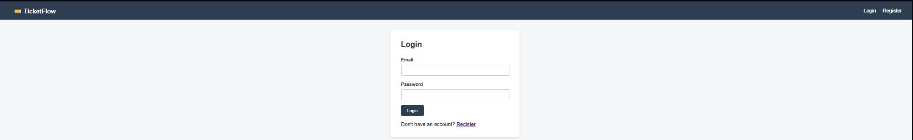
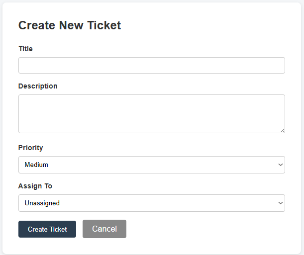
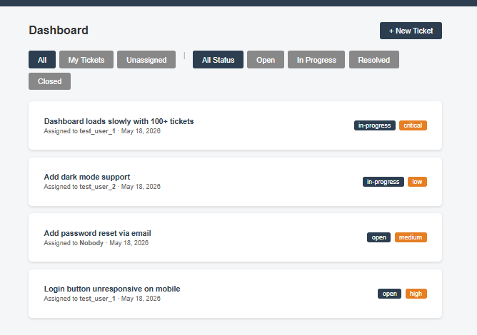
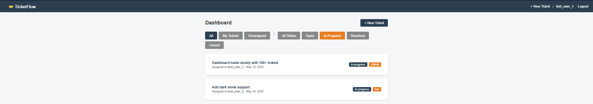
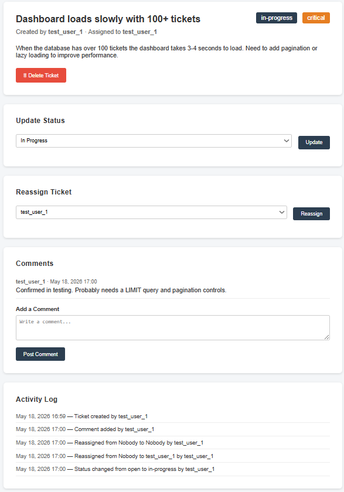

# 🎫 TicketFlow

A lightweight issue tracking web app built with Flask, designed for small teams.

## Features

- User registration and login
- Create, assign, and prioritize tickets
- Reassign tickets to different team members
- Status workflow: Open → In Progress → Resolved → Closed
- Filter tickets by assignee (All, My Tickets, Unassigned) and status
- Comments on tickets for team discussion
- Activity log tracking all changes on every ticket
- Delete tickets (creator or admin only)
- Clean, responsive UI with error pages

## Tech Stack

- Python 3.10+
- Flask
- SQLite + SQLAlchemy
- Flask-Login + bcrypt
- pytest

## Screenshots







## Setup

1. Clone the repo:

```bash
git clone https://github.com/YOUR_USERNAME/TicketFlow.git
cd TicketFlow
```

2. Create and activate a virtual environment:

```bash
python -m venv venv
venv\Scripts\activate
```

3. Install dependencies:

```bash
pip install -r requirements.txt
```

4. Set up the database:

```bash
python setup_db.py
```

5. Run the app:

```bash
python run.py
```

6. Open your browser and go to `http://127.0.0.1:5000`

> **Note:** This runs locally on your machine. For production deployment, see Flask's [deployment docs](https://flask.palletsprojects.com/en/stable/deploying/).

## Project Structure

```
TicketFlow/
├── app/
│   ├── __init__.py
│   ├── models.py
│   ├── routes/
│   │   ├── auth.py
│   │   ├── main.py
│   │   └── tickets.py
│   └── templates/
│       ├── base.html
│       ├── login.html
│       ├── register.html
│       ├── dashboard.html
│       ├── new_ticket.html
│       ├── view_ticket.html
│       ├── 404.html
│       └── 500.html
├── config.py
├── run.py
├── setup_db.py
├── requirements.txt
└── README.md
```

## Author

Shealin Rossi - sr.yueyuji@gmail.com

## License

This project is licensed under the MIT License — see the [LICENSE](LICENSE) file for details.
